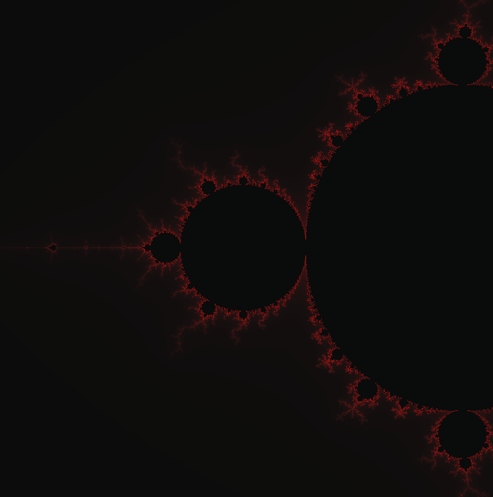

# Исследование влияния SIMD инструкций на скорость работы программ

## О чем данная работа

В данной работе было проведено сравнение скорости исполнения программ по рассчету [множества Мандельброта](https://ru.wikipedia.org/wiki/%D0%9C%D0%BD%D0%BE%D0%B6%D0%B5%D1%81%D1%82%D0%B2%D0%BE_%D0%9C%D0%B0%D0%BD%D0%B4%D0%B5%D0%BB%D1%8C%D0%B1%D1%80%D0%BE%D1%82%D0%B0) и по [альфа-блендингу](https://en.wikipedia.org/wiki/Alpha_compositing) двух изображений. За эталонную скорость работы принимается скорость работы без SIMD инструкций и с флагом компиляции -O3.

## Немного про SIMD инструкции

[SIMD](https://ru.wikipedia.org/wiki/SIMD) - принцип вычисления, позволяющий обеспечить параллелизм на уровне данных. 64-х битные инструкции начали поддерживаться в процессорах уже в 90-х годах. Первыми были MMX и SSE, но современные процессоры поддерживают уже инструкции AVX и AVX2, позволяющие работать одновременно со 128 или 256 битами.

# Исследование скорости работы

## Множество Мандельброта

В данной части работы будет рассмотрена программа отображающая на экран множество Мандельброта (далее множество для краткости), про которое можно узнать больше по ссылке в 1 секции. Каждый пиксель окна размером 1000х1000 пикселей имеет соответствующие ему координаты от \[-2, 1\] до \[0, -1\]. Далее, для каждой точки проводится серия вычислений, каждая итерация которых дает координаты некой другой точки. Как только расстояние от новой точки до точки \[0, 0\] становится больше 10 - вычисления останавливаются, и исходная точка красится в цвет, определяемый из количества итераций. Чем больше количество итераций - тем ближе цвет к красному. Если же количество итераций превосходит ограничение в 100, то точка красится в самый темный цвет, соответствующий 0.

Вот пример изображения, получаемого в результате запуска программы:



### Без AVX оптимизации

В данном разделе исследуется версия программы без SIMD инструкций. В таблице ниже приведены времена исполнения программы в тактах процессора, взятые как среднее за 100 её запусков.

| Метод компиляции | Количество тактов исполнения | Коеффициент ускорения |
|---|---|---|
| Без флагов | 214913.16 | 0.695 |
| С флагом -O3 | 149449.47 | 1.000 |
| С флагом -Ofast | 148968.02 | 1.004 |

Как мы видим, компиляция с флагами -O3 и -Ofast дает программы практически совпадающие по скорости работы. Также видно, что флаги ускоряют программу примерно в 1.4-1.5 раза. Версия программы, используемая в этом тесте приведена ниже.

```c++

/// @brief Calculates whole screens specs and writes to rgba array
/// @param rgba array of pixels in rgbquad format
void calcScr (unsigned char* rgba) {

    volatile float x = XLIML;   // initial x
    volatile float y = YLIMH;   // initial y
    float x00 = x;  // initial x save
    float shift = (XLIMH - XLIML) / ScrSize; // width of a pixel

    int cnt = 0;    // counts how many pixels were processed
    for (int scrIter = 0; scrIter < ScrSize * ScrSize * 4; scrIter+=4) {

        if (cnt == ScrSize) {

            x = x00;
            y -= shift;     // sets x and y for a new line of pixels
            cnt = 0;
        }

        // x = XLIML + float((scrIter / 4) % ScrSize) / ScrSize * (XLIMH - XLIML);
        // y = YLIMH - float(scrIter / (ScrSize * 4)) / ScrSize * (YLIMH - YLIML);      // obsolete methods that calculated each pixels location independently


        float x_0 = x;  // saves initial pos
        float y_0 = y;  // saves initial pos

        int i = 0;  // iter count
        for (i = 0; i < topCalcLimit; i++) {

            float x_2 = x * x;  // x, y squared
            float y_2 = y * y;  // x, y squared

            if (x_2 + y_2 > maxDistSq) break;
            y = 2 * x * y + y_0;       // calculation of new iteration
            x = x_2 - y_2 + x_0;    // calculation of new iteration

        }

        x = x_0 + shift;
        y = y_0;        // switches to the next pixel
        cnt++;

        if (i == topCalcLimit) i = 0; // sets to default color if maxxed out the calculation limit
        rgba[scrIter    ] = r0 + (i * (r1 - r0) / topCalcLimit); //
        rgba[scrIter + 1] = g0 + (i * (g1 - g0) / topCalcLimit); // setting color calculated as a simple fader (could be made logarithmical for the lols)
        rgba[scrIter + 2] = b0 + (i * (b1 - b0) / topCalcLimit); //
        rgba[scrIter + 3] = a0 + (i * (a1 - a0) / topCalcLimit); //
    }
}


```

Тестирующий код приведен в приложении 1 данной работы.

# С AVX оптимизациями + Вывод

Данная версия программы была переписана с использованием AVX1 и AVX2 инструкций для 256 битных векторов. По счастливой случайности размеры окна (1000х1000) делятся на 8. Способ вычисления для случаев, когда измерения изображения не кратны 8, приведен в программе Альфа-блендинга. В таблице ниже приведены времена исполнения программы в тактах, взятые как среднее за 100 её запусков.

| Метод компиляции | Количество тактов исполнения | Коеффициент ускорения |
|---|---|---|
| Без флагов | 125535.53 | 1.191 |
| С флагом -O3 | 32514.91 | 4.598 |
| С флагом -Ofast | 29413.53 | 5.083|

По данным, полученным в эксперименте, можно сделать следующие выводы

1) Простое включение флагов дает больший прирост производительности чем переписывание на SIMD инструкции без флагов. Вывод: переписывать на SIMD инструкции и не использовать флаги бессмыслено.
2) Программа с SIMD инструкциями и флагами оптимизации ускоряется по сравнению с компиляцией -O3 приблизительно в 4 раза, а по сравнению с компиляцией без флагов вообще в 7.3 раза. Вывод: правильное использование SIMD-а дает ускорение практически на порядок, что делает эту оптимизацию одной из первых в задаче оптимизации задач схожих с этой. Конечно же после флагов оптимизации.


Версия программы, использованная в этом тесте приведена ниже.

``` c++

/// @brief Calculates whole screens specs and writes to rgba array
/// @param rgbaArray array of pixels in rgbquad format
void calcScr (unsigned char* rgbaArray) {

    const __m256 maxDistSq256 = _mm256_set1_ps (maxDistSq);   // max dist vector
    const float oneShift = (XLIMH - XLIML) / ScrSize;
    const __m256 shift = _mm256_set1_ps (8 * oneShift);  // delta for each iteration of pixels
    volatile __m256 x = _mm256_set_ps (XLIML + 7.0 * oneShift,
                              XLIML + 6.0 * oneShift,
                              XLIML + 5.0 * oneShift,
                              XLIML + 4.0 * oneShift,
                              XLIML + 3.0 * oneShift,
                              XLIML + 2.0 * oneShift,
                              XLIML + 1.0 * oneShift,
                              XLIML + 0.0 * oneShift); //x initial
    volatile __m256 y = _mm256_set1_ps (YLIMH);
    __m256 x00 = x; //saving initial x

    int cnt = 0;
    for (int scrIter = 0; scrIter < ScrSize * ScrSize * 4; scrIter += 32) { // iterates in 8 pixel wide parts

        if (cnt >= ScrSize) {   //  if end of line
            x = x00;    // reset x
            y = _mm256_sub_ps (y, _mm256_set1_ps (oneShift));// shift y
            cnt = 0;// zero cnt
        }

        __m256 x0 = x;  // saves start coords
        __m256 y0 = y;  // saves start coords

        volatile __m256i iRes = _mm256_setzero_si256 ();

        for (int i = 0 ; i < topCalcLimit; i++) {

            __m256 x2 = _mm256_mul_ps (x, x);   // squared
            __m256 y2 = _mm256_mul_ps (y, y);   // squared

            __m256 mask = _mm256_cmp_ps (_mm256_add_ps (x2, y2), maxDistSq256, _CMP_LE_OQ); // mask[i] = 0xFFFFFFFF if further calculation needed for point, 0x0 otherwise
            __m256i imask = _mm256_castps_si256 (mask); // the same but __m256i

            iRes = _mm256_add_epi32 (_mm256_and_si256 (imask, _mm256_set1_epi32 (1)), iRes);

            if (_mm256_movemask_epi8 (imask) == 0) break; // if no calcs needed (all == 0x0) then break

            y = _mm256_add_ps (_mm256_and_ps (mask, _mm256_sub_ps (     // condition to not calc ones that are zeroed in mask
                _mm256_add_ps (_mm256_mul_ps (_mm256_set1_ps (2.0), _mm256_mul_ps (x, y)), y0), // expression
                y)), y); // end of condition
            x = _mm256_add_ps (_mm256_and_ps (mask, _mm256_sub_ps (
                _mm256_add_ps (_mm256_sub_ps (x2, y2), x0),             // the same as 2 lines up
                x)), x);
        }

        x =_mm256_add_ps (x0, shift);   // shifts x cause its faster than recalculating every time
        y = y0; // resets y
        cnt += 8; // adds cnt

        iRes = _mm256_and_si256 (iRes, _mm256_xor_si256 (_mm256_set1_epi8 (0xFF), _mm256_cmpeq_epi32 (iRes, _mm256_set1_epi32 (topCalcLimit)))); //sets iRes[i] = 0 if iRes[i] == topCalcLimit

        int iResInt[8] = {0};
        _mm256_maskstore_epi32 ( (int*) iResInt, _mm256_set1_epi8 (0xFF), iRes);    // this part was not optimized because it would be very painful to do, and would do next to no effect on performance (unless topCalcLimit is set to around 10 or lower)

        for (int i = 0; i < 8; i++) {

            rgbaArray[scrIter + 4 * i + 0] = r0 + (iResInt[i] * (r1 - r0) / topCalcLimit);  // Formats i into color with alpha
            rgbaArray[scrIter + 4 * i + 1] = g0 + (iResInt[i] * (g1 - g0) / topCalcLimit);  // Formats i into color with alpha
            rgbaArray[scrIter + 4 * i + 2] = b0 + (iResInt[i] * (b1 - b0) / topCalcLimit);  // Formats i into color with alpha
            rgbaArray[scrIter + 4 * i + 3] = a0 + (iResInt[i] * (a1 - a0) / topCalcLimit);  // Formats i into color with alpha
        }
    }
}

```

## Альфа блендинг

Данная программа накладывает изображение кота на изображение высадки астронавтов на луну. Для большей ясности результатов вычисление каждой точки производилось 1000 раз. Пример изображения, получающегося в результате запуска программы:


# Без AVX оптимизации

В данном разделе исследуется версия программы без SIMD инструкций. Данные времени работы, усредненные по 100 запускам приведены ниже.

| Метод компиляции | Количество тактов исполнения | Коеффициент ускорения |
|---|---|---|
| Без флагов | 238629.04 | 0.554 |
| С флагом -O3 | 132191.60 | 1.000 |
| С флагом -Ofast | 132767.19 | 0.996 |

Результаты отдаленно напоминают картину из прошлого эксперимента: флаг -О3 ускоряет почти в 2 раза; -Ofast не сильно отличается по ускорению от -O3. Но в этом эксперименте -Ofast отличается в худшую сторону, но это смело можно списать на погрешность из-за малой разницы (<1%).

Версия программы, использованная в данном эксперименте:

```c++

#include "head.h"

void calcScr (unsigned char* background, unsigned char* buranya,
              unsigned int overSizeX, unsigned int overSizeY,
              unsigned int backSizeX, unsigned int backSizeY,
              const unsigned int x0, const unsigned int y0) {

    for (unsigned int y = overSizeY - 1; y > 0; y--) {

        for (unsigned int x = 0; x < overSizeX; x++) {

            volatile unsigned int backIter = (y0 + y) * backSizeX * 4 + (x0 + x) * 4;    // iterator for background image
            volatile unsigned int overIter = y * overSizeX * 4 + x * 4;      // iterator for overlay image
            volatile unsigned char alpha = buranya[overIter + 3];        // alpha value, so that it doesn't get changed
            volatile unsigned char screen[4] = {0};     // current pixel values for calculation, so that real ones don't change

            for (int i = 0; i < topCalcLimit; i++) {

                screen[0] = (buranya[overIter    ] * alpha + background[backIter    ] * (255 - alpha)) >> 8;    // red blending
                screen[1] = (buranya[overIter + 1] * alpha + background[backIter + 1] * (255 - alpha)) >> 8;    // blue blending
                screen[2] = (buranya[overIter + 2] * alpha + background[backIter + 2] * (255 - alpha)) >> 8;    // green blending
                screen[3] = (buranya[overIter + 3] * alpha + background[backIter + 3] * (255 - alpha)) >> 8;    // alpha blending
            }

            memcpy (background + backIter, (char*) screen, 4); // saving pixel values to background image
        }
    }
}

```

# C AVX оптимизацией + Вывод

В данном разделе исследуется скорость работы программы с имплиментрованными SIMD инструкциями. Результаты среднего времени работы программы по 100 запускам представлены в таблице ниже.

| Метод компиляции | Количество тактов исполнения | Коеффициент ускорения |
|---|---|---|
| Без флагов | 208702.35 | 0.633 |
| С флагом -O3 | 2965.47 | 44.577 |
| С флагом -Ofast | 2939.78 | 44.967 |

В данном эксперименте наблюдается картина, абсолютно отличная от того, что было получено для программы по расчету множества Мандельброта.
1) Мы видим, что прирост производительности без флагов получается сильно меньше чем там (1.14 вместо ~2).
2) Так же ускорение при использование SIMD-a вместе с флагами преобретает совершенно другой порядок (~45 против 5). А именно улучшение улучшения производительности почти в 9 раз.

Эти результаты подводят к тому, что используемые в этой программе AVX инструкции ещё лучше ускоряются компилятором и дает очень большое уменьшение количества мувов.

В дополнение можно сказать, что эта программа написана исключительно на интринсиках, в то время как в предыдущей программе запись в память велась без SIMD-a. Но маловероятно, что из-за этого ускорение падает в 9 раз.

Код программы использованной в данном тесте:

```c++

#include "head.h"

void calcScr (unsigned char* background, unsigned char* buranya,
              const unsigned int overSizeX, const unsigned int overSizeY,
              const unsigned int backSizeX, const unsigned int backSizeY,
              const unsigned int x0, const unsigned int y0) {

    int* overArray = (int*) buranya;    // int ptr for overlay (1 int is 1 pixel)
    int* backArray = (int*) background; // int ptr for background

    volatile const __m256i epi8Lo_epi16 = _mm256_set_epi8 (-1, 14, -1, 12, -1, 10, -1, 8, -1, 6, -1, 4, -1, 2, -1, 0, -1, 14, -1, 12, -1, 10, -1, 8, -1, 6, -1, 4, -1, 2, -1, 0);
    // mask to convert lower part of each epi16 to epi16
    volatile const __m256i epi8Hi_epi16 = _mm256_set_epi8 (-1, 15, -1, 13, -1, 11, -1, 9, -1, 7, -1, 5, -1, 3, -1, 1, -1, 15, -1, 13, -1, 11, -1, 9, -1, 7, -1, 5, -1, 3, -1, 1);
    // mask to convert higher part of each epi16 to epi16

    volatile const __m256i shr8 = _mm256_set_epi8 (-1, 15, -1, 13, -1, 11, -1, 9, -1, 7, -1, 5, -1, 3, -1, 1, -1, 15, -1, 13, -1, 11, -1, 9, -1, 7, -1, 5, -1, 3, -1, 1);
    //mask to shift right 8 bits
    volatile const __m256i blender = _mm256_set_epi8 (0xFF, 0, 0xFF, 0, 0xFF, 0, 0xFF, 0, 0xFF, 0, 0xFF, 0, 0xFF, 0, 0xFF, 0, 0xFF, 0, 0xFF, 0, 0xFF, 0, 0xFF, 0, 0xFF, 0, 0xFF, 0, 0xFF, 0, 0xFF, 0);
    // mask to blend 2 epi8 numbers (a, b) with each first from b, and each second from a

    // masks to handle image size not being %8
    volatile const __m256i masks[9] = {
                               _mm256_setzero_si256 (),
                               _mm256_set_epi32 (0, 0, 0, 0, 0, 0, 0, 0xFFFFFFFF),
                               _mm256_set_epi32 (0, 0, 0, 0, 0, 0, 0xFFFFFFFF, 0xFFFFFFFF),
                               _mm256_set_epi32 (0, 0, 0, 0, 0, 0xFFFFFFFF, 0xFFFFFFFF, 0xFFFFFFFF),
                               _mm256_set_epi32 (0, 0, 0, 0, 0xFFFFFFFF, 0xFFFFFFFF, 0xFFFFFFFF, 0xFFFFFFFF),
                               _mm256_set_epi32 (0, 0, 0, 0xFFFFFFFF, 0xFFFFFFFF, 0xFFFFFFFF, 0xFFFFFFFF, 0xFFFFFFFF),
                               _mm256_set_epi32 (0, 0, 0xFFFFFFFF, 0xFFFFFFFF, 0xFFFFFFFF, 0xFFFFFFFF, 0xFFFFFFFF, 0xFFFFFFFF),
                               _mm256_set_epi32 (0, 0xFFFFFFFF, 0xFFFFFFFF, 0xFFFFFFFF, 0xFFFFFFFF, 0xFFFFFFFF, 0xFFFFFFFF, 0xFFFFFFFF),
                               _mm256_set1_epi32 (0xFFFFFFFF),
                               };

    volatile unsigned int cnt = 0;   // counter of pixels in current line
    volatile unsigned int overIter = 0; // overlay iter
    volatile unsigned int backIter = y0 * backSizeX + x0; // background iter

    for (;;) {

        if (overIter >= overSizeX * overSizeY) break; // if all overlay was blended, break

        if (cnt >= overSizeX) { // go to new line in background

            cnt = 0;
            backIter += backSizeX - overSizeX;
        }

        volatile __m256i mask = masks[(cnt + 8) > overSizeX ? overSizeX - cnt : 8]; // current mask for given cnt
        volatile __m256i over = _mm256_maskload_epi32 (overArray + overIter, mask); // 8 pixels (or less if mask != masks[8]) from overlay
        volatile __m256i back = _mm256_maskload_epi32 (backArray + backIter, mask); // -//- from background
        volatile __m256i alpha = _mm256_shuffle_epi8 (over, _mm256_set_epi8 (-1, 15, -1, 15, -1, 11, -1, 11, -1, 7, -1, 7, -1, 3, -1, 3, -1, 15, -1, 15, -1, 11, -1, 11, -1, 7, -1, 7, -1, 3, -1, 3));
        // alpha from overlay
        volatile __m256i backLo = _mm256_setzero_si256 ();  //backLo is defined outside of loop because it will be used as storage for an output value

        for (int i = 0; i < topCalcLimit; i++) {

            volatile __m256i overLo = _mm256_shuffle_epi8 (over, epi8Lo_epi16); // lower half of each epi16 over
            volatile __m256i overHi = _mm256_shuffle_epi8 (over, epi8Hi_epi16); // higher half of each epi16 over

                             backLo = _mm256_shuffle_epi8 (back, epi8Lo_epi16); // lower half of each epi16 back
            volatile __m256i backHi = _mm256_shuffle_epi8 (back, epi8Hi_epi16); // higher half of each epi16 back

            overHi = _mm256_mullo_epi16 (overHi, alpha); // multiply over pixel vals by alpha
            overLo = _mm256_mullo_epi16 (overLo, alpha);

            backHi = _mm256_mullo_epi16 (backHi, _mm256_sub_epi16 (_mm256_set1_epi16 (255), alpha)); // multiply back pixel vals by 255 - alpha
            backLo = _mm256_mullo_epi16 (backLo, _mm256_sub_epi16 (_mm256_set1_epi16 (255), alpha));

            backLo = _mm256_add_epi16 (backLo, overLo); // sum up over and back
            backHi = _mm256_add_epi16 (backHi, overHi);


            backLo = _mm256_shuffle_epi8 (backLo, shr8); // shift right backLo
            backLo = _mm256_blendv_epi8 (backLo, backHi, blender); // blend backLo and backHi
        }

        _mm256_maskstore_epi32 (backArray + backIter, mask, backLo); // store calculated pixels in array

        overIter = (cnt + 8) > overSizeX ? overIter + overSizeX - cnt : overIter + 8; // shift over and back depending on how many pixels left till line os over
        backIter = (cnt + 8) > overSizeX ? backIter + overSizeX - cnt : backIter + 8; // shift over and back depending on how many pixels left till line os over
        cnt = (cnt + 8) > overSizeX ? overSizeX : cnt + 8; // shift cnt
    }
}

```

## Глобальный вывод

Обе программы показывают, что флаги оптимизации стабильно ускоряют программу в 1.4-1.6 раз. Так же видно, что переписывание программы на интринсики без использования флагов оптимизации есть абсолютно бессмысленное занятие, ведь оно дает ускорение меньше чем просто включение флагов, а требуют много больших усилий. SIMD + -О3 дает хорошее ускорение программы (-Оfast дает резултаты в пределах погрешности от -О3), но порядок ускорения сильно зависит от самой задачи и (скорее всего) от соотношения интринсиков и не-интринсиков. Полученные результаты могут указывать на то, что некоторые SIMD инструкции ускоряются много лучше чем другие, что дает вариацию ускорения в зависимости от задачи.

### Приложение 1

В данном приложении будет описан метод съема показаний.

## Общая методика замера времени

В данной работе я решил не измерять количество кадров в секунду, а измерять процессорное время работы в тактах. Такое решение было мной принято в силу большей простоты измерения данного параметра и возможности определять какой код измеряется (основной), а какой нет (вспомогательный, например визуализация результатов работы программы).

## Другие решения использованные в программах тестировки

Программа для измерения была написана так, что добавление новых функций расчета изображения может производится с нулевым изменением программы и минимальным изменением мэйкфайла.

Так же имеется заголовочный файл с константами, которые позволяют менять параметры вычисления сразу для всех функций расчета. Это позволяет менять параметры эксперимента максимально централизованно.

Так же время работы измерялось при помощи запуска отдельной программы, а не последовательных вызовов одной и той же функции. Это сделано для того, чтобы сделать условия работы программы на каждой итерации максимально приближенными к реальности.